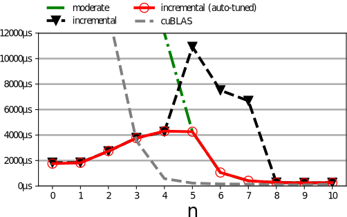
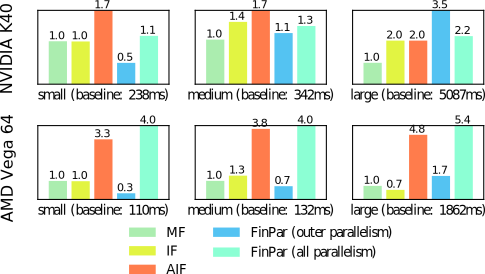
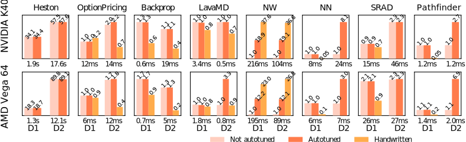

This Monday I presented Futhark at `PPoPP`_, a large academic
conference on the principles and practice of parallel programming.  As
`with the PLDI paper <2017-06-25-futhark-at-pldi.html>`_, this blog
post is the main substance of the paper condensed into a more
accessible form (but you can get the `paper PDF`_ if you want all the
gory details).

.. _`PPoPP`: https://ppopp19.sigplan.org/

Background on Flattening
------------------------

Functional data-parallel programming guarantees the absence of race
conditions - its semantics are entirely sequential - yet easily
expresses large amounts of fine-grained parallelism, which can be
exploited by a compiler.  These properties have made data parallel
programming a popular topic for researchers trying to address the
challenges in programming parallel computers.  In particular, data
parallel functional programming has proven successful at exploiting
massively parallel, but restricted, devices such as GPUs (see
e.g. `Accelerating Haskell array codes with multicore GPUs
<https://dl.acm.org/citation.cfm?id=1926358>`_).

*Flat* data parallelism is relatively simple to map to
efficient code.  Consider what is perhaps the simplest data parallel
operation: ``map``.  An expression ``map f xs`` applies the
function ``f`` to every element of the array ``xs``,
producing a new array.  This can be straightforwardly translated to
parallel code by simply launching one thread per element in
``xs``.  On machines with heavyweight threads, where the cost of
thread creation outweighs the cost of a single application of
``f``, it is not hard to divide ``xs`` into multiple chunks,
each of which is then assigned to a thread that performs multiple
applications of ``f``.

*Nested data parallelism*, which occurs when ``f`` itself contains
parallel operations, is more challenging.  The naive approach, of just
letting each thread spawn more sub-threads to handle nested parallel
invocations, is often slow in practice due to the overhead incurred by
thread management.  Further, on devices such as GPUs, nested
parallelism is only partially supported at the hardware level, and
care must be taken to obtain good performance.  What is needed is an
algorithm for turning nested data parallelism into flat data
parallelism.

Fortunately, Guy Blelloch's groundbreaking work on NESL in the 90s
produced the *flattening transformation* (the curious can peruse
`Blelloch's book <https://www.cs.cmu.edu/~guyb/papers/Ble90.pdf>`_),
which was also been implemented on GPU hardware by Lars Bergstrom and
John Reppy (`2012 paper
<https://dl.acm.org/citation.cfm?id=2364563>`_).  This algorithm
transforms all nested arrays into one-dimensional vectors with
associated *segment descriptors*, and all nested data parallelism into
flat-parallel segmented operations on such vectors.  One important
property of flattening is that it preserves the time complexity of the
original program (both work and span), thus exploiting *all* available
parallelism.

Unfortunately, traditional flattening has two main weaknesses.  First,
it preserves *time* asymptotics, but may cause a polynomial increase
in *space*.  Second, it unconditionally exploits all available
parallelism, even that which may be unnecessary to fully saturate a
specific parallel machine, and which may carry a high overhead to
exploit.  Let us illustrate with a few examples.

Problem one: space blowup
~~~~~~~~~~~~~~~~~~~~~~~~~

Consider a program multiplying two matrices ``xss`` and ``yss`` of
shape *n×m* and *m×n* respectively:

.. code-block:: Futhark

  map (\xs -> map (\ys -> let zs = map2 (*) xs ys
                          in reduce (+) 0 zs)
                  yss)
      xss

Full flattening will produce a sequence of flat-parallel segmented
instructions, that conceptually perform the following operations:

.. code-block:: Futhark

  let ysss = replicate n (transpose yss)
  let xsss = map (replicate n) xss
  let zsss = map2 (map2 (map2 (*))) xsss ysss
  in map (map (reduce (+) 0)) zsss

We are using multidimensional arrays here for simplicity, but they are
semantically flat, as all rows have the same size.  The first two
lines produce two *n×n×m* arrays, which are then element-wise
multiplied in line three, and finally line four performs a summation
along the innermost (size *m*) dimension, producing an *n²* array.
These large intermediate arrays make full flattening intractable for
larger problems.

Perhaps the most obvious approach is to employ loop fusion on the
generated flat code.  However, this has proven difficult in practice.
This is both because fusion can be relatively fragile and depend on a
large number of enabling optimisations, and because segmented
operations turn out to have a complicated fusion algebra, requiring
sophisticated shape analysis (but maybe `John Reppy will come up with
a solution for his Nessie compiler
<http://nessie.cs.uchicago.edu/>`_).  This problem is particularly
acute when the segments are irregular.

Other attempts to address the issue involve modifying the flattening
algorithm itself.  `Data-only flattening
<https://dl.acm.org/citation.cfm?id=2442525>`_ is an approach that
flattens only the data, while leaving the structure of the code
intact, which removes the need for large intermediate structures like
the one we saw for matrix multiplication.  However, data-only
flattening is not a good fit for massively parallel devices that
depend on fine-grained parallelism, such as GPUs, because the parallel
structure of the program remains nested.  Further, this approach does
not address the other problem with flattening, over-parallelisation,
as we shall discuss next.

Problem one: unnecessary parallelism
~~~~~~~~~~~~~~~~~~~~~~~~~~~~~~~~~~~~

The core problem with the matrix multiplication example is the
decision to exploit all three levels of parallelism, especially since
the innermost level - which contains a reduction - is relatively
expensive to exploit.  If the two outer ``map``s together contain
sufficient parallelism, which is usually (but not always!) the case,
then it is better to transform the innermost ``map``-``reduce`` into a
low-overhead sequential loop.  Indeed, in practice, most
high-performance matrix multiplication routines are written under this
assumption, and exploit the regular structure of the innermost loop to
perform `loop tiling
<https://en.wikipedia.org/wiki/Loop_nest_optimization#Example:_matrix_multiplication>`_,
in order to reduce the amount of memory traffic or improve cache
behaviour.

We technique we previously developed for Futhark, which we now call
*moderate flattening*, focused on "common case" parallelism.  It is a
more limited technique than full flattening, as it addresses only
*regular* nested parallelism, where the size of all nested parallelism
is invariant to the outer levels of parallelism.  For example, the
following function contains irregular parallelism as the size ``x``
(which controls the amount of parallelism in the inner ``reduce``) may
not be the same for different iterations of the outer ``map``:

.. code-block:: Futhark

  let f (a: [n]i32) =
    map (\x -> reduce (+) 0 (1...x)) a

While the restriction to regular parallelism does preclude some
programs from being easily expressible, notably most graph algorithms,
it simplifies the treatment of those algorithms that require only
regular nested parallelism, which turn out to be a surprisingly useful
amount.

Moderate flattening uses heuristics to sequentialise nested
parallelism that is judged unlikely to be necessary, and which is
expensive to exploit.  Instead, this *excess parallelism* is turned
into efficient sequential code, often by exploiting the rich
functional semantics to perform optimisations such as loop tiling or
sequential fusion.  In essence, a compiler employing moderate
flattening is not a *parallelising* compiler, as the parallelism is
already evident in the source program, but a *sequentialising*
compiler.

The main limitation of moderate flattening is that it relies on a
static set of assumptions that may be invalid for any given program or
workload.  For example, moderate flattening will always sequentialise
nested ``map``-``reduce`` compositions, such as in our matrix
multiplication example.  Thus, when multiplying an *n✕m* and *m✕n*
matrix, parallelism of degree *n²* will be exploited.  This is
efficient when *n* is large, but when *n* is small and *m* is large
the machine will be under-utilised.  In the worst case, when *n=1*,
the program will be executed entirely sequentially!  This is clearly
not a productive use of the parallelism that the programmer provided
in the original program.

We are unfortunately led to conclude that there is no *one size fits
all* compilation scheme for nested data parallelism.  Optimal code
depends not just on the target architecture, but also on workload
characteristics, which is information that is usually not available at
compile-time.  Therefore we developed an extension of moderate
flattening, called *incremental flattening*, which generates multiple
different code versions for each instance of nested parallelism, and
at run-time picks the one that exploits the *least* amount of
parallelism needed to saturate the actual machine, based on the shape
of the actual input encountered.  This, in theory, allows us to avoid
paying an overhead on parallelism we do not need, while still scaling
to workloads that demand that all parallelism is exploited.

Incrementally flattened matrix multiplication
---------------------------------------------

Let us return to the matrix multiplication example again (this is the
*hello world* of data parallel programming):

.. code-block:: Futhark

    map (\xs ->
           map (\ys -> let zs = map2 (*) xs ys
                       in reduce (+) 0 zs)
               yss)
        xss

Moderate flattening will compile this to a program where the two outer
``map``s are executed in parallel, and the inner ``map``-``reduce`` is
turned into a sequential loop.  It will look a lot like this:

.. code-block:: Futhark

    map (\xs ->
           map (\ys ->
                  foldl (\acc (x,y) -> acc + x * y)
                        0 (zip xs ys))
               yss)
        xss

The compiler will then also perform access pattern optimisations
(tiling) on the inner fold.  This is also how most hand-written
optimised matrix multiplications do it.  If we assume that the sizes
of the two outer ``map``s are *n* and *m*, then incremental flattening
will produce something like this:

.. code-block:: Futhark

   if n * m > t0 then
     -- Do what moderate flattening does.
   else
     -- Execute full segmented reduction.

Essentially, we are checking if the amount of parallelism in the
``map``s exceeds some threshold ``t0``, and if so, we use the least
parallel version.  Only if necessary to saturate the hardware do we
execute a fully parallel version.

(Actually that segmented reduction is on its own interesting enough
that we `also wrote a paper about that
<https://futhark-lang.org/docs.html#strategies-for-regular-segmented-reductions-on-gpu>`_)

Thus, the essence of incremental flattening is this:

    From a single source program, for each parallel construct generate
    multiple *semantically equivalent* parallelisations, and generate
    a *single program* that at run-time picks the *least parallel* that
    still saturates the hardware.

Let's see how the performance of matrix multiplication behaves as we
vary how much parallelism is present in the outer ``map``s, and how
much is in the inner ``map``-``reduce`` composition.  If we are
multiplying a matrix of size *2ⁿ✕2ᵐ* with its transpose of size
*2ᵐ✕2ⁿ*, then we can keep the *total* work constant as we vary *n* by
setting *m=25-2n* (the *25* is just some workload factor).  In a
perfect world, the time to multiple the two matrices would be exactly
the same as *n* changes.  Alas, we do not live in a perfect world.

The following graph shows how the run-time of four different
implementations of matrix multiplication change as we vary *n*:

1. Moderate flattening.

2. Incremental flattening, but using the default value for the
   threshold parameter *t0*.

3. Incremental flattening, but after auto-tuning *t0* to obtain an
   optimal/better value (basically, searching for it).

4. NVIDIAs highly optimised `cuBLAS
   <https://developer.nvidia.com/cublas>`_ library.

As a larger *n* corresponds to more parallelism in the outer ``map``s,
we see that cuBLAS performs really well above *n=3*.  This is not
surprising: NVIDIA has many sufficiently smart engineers working on
making its matrix multiplications run fast.  For small *n*, cuBLAS
performance drops off a cliff (or ascends a mountain, depending on
your perspective), because there is just not enough outer parallelism
left - and each of the few active GPU threads have to do a lot of
work.  The curve is the same for moderate flattening, although shifted
a bit to the right, probably because cuBLAS's advanced low-level
optimisations can better offset the lack of parallelism.

Incremental flattening performs reasonably for all dataset.  We can
clearly see the point where it switches from the fully-parallel to the
moderately-flattened version (*n=8* in the untuned case, and *n=5* in
the tuned case).

While this is a very simple example, and one can reasonably argue that
incremental flattening does not actually perform all that well for low
*n* compared to high *n*, we at least stand a reasonable chance of
simply improving the implementation segmented reduction in the Futhark
compiler.  In contrast, *nobody* hand-writing optimised GPU code is
likely to want to write multiple semantically equivalent
implementations of their program, just to optimally handle all
distributions of parallelism.  And even if you can find someone who
*does* want to do that, they will rarely have the time.

Incremental flattening for intra-group parallelism
--------------------------------------------------

The incremental flattening can also be used for more subtle purposes
than merely controlling how much parallelism to exploit.  GPUs are not
completely `bulk synchronous machines
<https://en.wikipedia.org/wiki/Bulk_synchronous_parallel>`_, but have
a bit of topology that can be profitably exploited.  Specifically, GPU
threads are not completely independent, nor are they completely
connected.  Rather, they are divided into *work-groups* (or *thread
blocks* in NVIDIA terms), within which threads can communicate with
each other, primarily through fast (and very small) *local memory*
(NVIDIA calls this *shared memory*).  Thus, instead of merely deciding
between whether inner parallelism should be sequentialised or fully
exploited, we can also try to *execute it at the work-group level*.
This is a subtle thing, so let me illustrate with an excerpt from the
`LocVolCalib
<https://github.com/diku-dk/futhark-benchmarks/blob/master/finpar/LocVolCalib.fut>`_
benchmark, taken from the `FinPar benchmark suite
<https://dl.acm.org/citation.cfm?id=2898354>`_:

.. code-block:: Futhark

   map (\xss ->
          map (\xs ->
                let bs = scan f 0 xs
                let cs = scan g 0 bs
                in  scan h 0 cs)
              xss)
       xsss

This is a ``map`` nest containing three parallel ``scan``s (also
called a `prefix sum <https://en.wikipedia.org/wiki/Prefix_sum>`_,
although LocVolCalib uses a fancier operator than mere addition).
Using the simple form of incremental flattening discussed above, the
compiler would create two versions: one where we launch a thread for
each iteration of the outer ``map``s, each of which then performs the
three ``scan``s sequentially, and one where we completely flatten the
expression to three fully parallelised segmented scans, as thus:

.. code-block:: Futhark

   let bsss =
     map (\xss -> map (\xs -> scan f 0 xs) xss) xsss
   let csss =
     map (\bss -> map (\bs -> scan g 0 bs ) bss) bsss
   in
     map (\css -> map (\cs -> scan h 0 cs) css) csss

The problem with the latter is that the intermediate arrays ``bsss``
and ``csss`` have to be manifested in GPU global memory, which is
relatively slow (although very fast by CPU memory standards).  In this
case, as long as the inner ``scan``s operate on arrays that are
sufficiently small (fit in a work-group; usually at most 256 to 1024
elements), we might in principle not need any synchronisation outside
the work-group at all, apart from when we copy the final result back to
global memory.

So we have a third option for incremental flattening: launch one
*work-group* of threads for each of the ``map`` iterations and execute
the innermost ``scan``s at the work-group level.  This is only valid
when the innermost parallelism small enough to fit (GPU work-groups are
typically limited to at most 1024 threads), which we cannot generally
know at compile-time.  Thus, again, this version is protected by a
run-time check.  We call this *intra-group parallelism*.

The performance impact of this can be quite significant.  The
following graph shows speedup relative to moderate flattening on the
LocVolCalib benchmark (higher is better), on two different GPUs, and
with three Futhark implementations and two hand-written OpenCL
implementations from FinPar.  Each implementation is then also
executed on three data sets.  Here, "tuning" refers simply to
automatically calibrating the various threshold parameters to fit the
hardware.  The two FinPar versions correspond to sequentialising the
``scan``s ("outer parallelism") and executing them at the work-group
level ("all parallelism"), the way Futhark can also do it.

For correctness/safety reasons, untuned incremental flattening will
currently never pick the intra-group parallel version, so the
performance improvement we sometimes see when tuning is precisely this
kicking in.  Note that intra-group parallelism is beneficial on the
large dataset on the Vega 64 GPU, but not on the K40.  This is despite
the large dataset being engineered to contain sufficient parallelism
in the outer ``map``s.  The reason we see this effect on the Vega 64
is likely because it is even more memory-starved relative to its
computational power than the K40, and so the impact of minimising
global memory accesses is more dramatic.

Note that, as with the matrix multiplication example, Futhark cannot
(always) outperform expertly hand-written GPU code.  However, the
effort to implement the two FinPar versions of LocVolCalib exceeds by
orders of magnitude the effort required to implement LocVolCalib in
Futhark.  Further, the two FinPar versions are completely distinct
programs, while the incrementally flattened Futhark version is a
single compiled program that can handle multiple workloads
efficiently.

The paper contains a performance validation of incremental flattening
on eight further benchmarks, mostly from the standard `Rodinia
<http://lava.cs.virginia.edu/Rodinia/download_links.htm>`_ suite, each
with two datasets that differ in which levels of parallelism are the
most intensive.  For brevity I will not discuss these in detail, but
the speedup graphs is reproduced here (again, higher is better):

One clear thing to take away is that in practice, Futhark seems to
perform quite well against the GPU code that programmers tend to
actually write (and publish!).  Futhark does significantly lose on NW,
where the Rodinia implementation is particularly cleverly written, but
on average most GPU programs seem to contain inefficiencies that are
left in because they are tedious to remove, or result in
unmaintainable code.  In particular, *no* Rodinia benchmarks do any
kind of multi-versioning, but simply assume that all the parallelism
is concentrated at the outermost level.

Summing Up
----------

There are two main points to take away:

  1. When dealing with nested data parallelism, there is no *one size
     fits all*.

  2. With incremental flattening, Futhark is able to generate *all the
     sizes*, and at run-time pick the one that fits the workload
     encountered.

Personally, I'm particularly pleased that we managed to implement
incremental flattening without modifying the source language at all.
It gives me further confidence that a simple set of data-parallel
combinators, that closely resemble existing widely used higher-order
functions, are enough to support a great many interesting programs.

So, can you download the Futhark compiler and try it out right now?
`Yes!  <https://futhark.readthedocs.io/en/latest/installation.html>`_
Although for boring technical reasons mostly related to our continuous
integration setup, incremental flattening is still hidden behind a
feature flag, so you'll have to set the environment variable
``FUTHARK_INCREMENTAL_FLATTENING=1`` to enable it.
