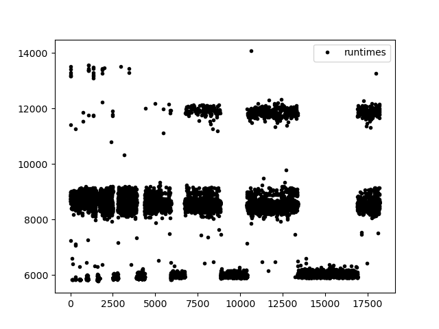

I no longer write blog posts for every single release.  This is
because most releases simply contain bugfixes or optimisations that
might matter to the affected users, but don't make for very
interesting reading to the uninitiated ([see for
yourself](https://github.com/diku-dk/futhark/blob/master/CHANGELOG.md)).
Because let's be realistic - most people reading these blog posts are
not Futhark programmers, in the same sense that they also don't drive
a Ferrari.

So what makes this release merit a blog post?  It has a handful of
features that I not only find exciting, but that we also obtained with
little effort from my side.  See, most of Futhark's development
occurs at the University of Copenhagen, where students are required to
undertake a project at the end of their undergraduate and master's
programmes.  Doing such projects are among the most memorable
experiences of my own time as a student, and I want new generations to
have the same experience.  Going beyond what I accomplished myself, I
also want the students to have a chance to contribute to a *real*
project (if an obscure one), with actual users and people who truly
care about the quality of their work, because they will make actual
use of it.

Or to take a more cynical view, we exploit a source of forced labour
provided to us by the university.  This is by itself not new - Futhark
development has long made use of students [both as
labour](2017-12-27-reflections-on-a-phd-accidentally-spent-on-language-design.html#but-then-the-compiler-worked)
and as [human test
subjects](https://github.com/diku-dk/dpp-e2021-pub).  The unusual part
this time around is that two students managed to complete a meaningful
subset of their work early enough for it to be included in a compiler
release, *before* they had to finish their project.  This will permit
a kind of real-world testing that is not normally feasible for these
projects.  I think we got lucky by a combination of motivated students
and focused and constrained projects.  It's probably not something we
can reliably repeat in the future, but it certainly is a nice experience.

On to the features!

# Holes

The first new feature is *holes*, developed by [Sun
Hoaran](https://haoranpb.github.io/) as part of his master's thesis.
Holes are a feature that I believe originally comes from dependently
typed languages such as
[Idris](http://docs.idris-lang.org/en/latest/elaboratorReflection/holes.html),
although Futhark's version takes more inspiration from
[Flix](https://flix.dev/).

Essentially, a hole is written as `???`  and represents a placeholder
expression of unknown type.  The type checker will infer the type of
the hole and tell you what it is through a warning.  In a language
with a sufficiently fancy type system and tooling, this can even be
used to suggest expressions that can fill the hole.  Futhark is not
quite at that level, so here holes function more like `undefined` in
Haskell.  This allows a style of type-driven programming where you
define the types of the functions in your design, but don't actually
give them definitions until later when the design is done.  First you
build the skeleton, then you put on the meat.  I use this approach
often in Haskell.  It's a simple feature, but it can be quite pleasant
to use.

You can compile and run a program with holes, although it will fail at
run-time if the hole is executed.  This can be useful for putting
holes in branches that you haven't thought about how to handle yet.

# The Futhark language server

Typed holes are not really what Sun Haoran's project is about, and was
more of a warmup exercise.  His real work is the creation of a
[language server](https://langserver.org/), which can be used to power
IDE-like features in various editors.  [VS
Code](https://code.visualstudio.com/), the originator of the Language
Server Protocol (LSP), is likely still the most prominent user, but
language servers [also work well in an elegant editor for a more
civilised age](https://github.com/joaotavora/eglot).  Language servers
can become incredibly advanced, but the one for Futhark is still
fairly basic.  It currently supports "hover information", such as
showing the type of the variable under the cursor, as well as jumping
to its definition.  The foundations are sound, so we can gradually
grow the feature set over time.  The server comes with the compiler
and can be run as `futhark lsp`, but unless you enjoy typing the LSP
wire format by hand, you are better off using the [VS Code language
extension](https://marketplace.visualstudio.com/items?itemName=DIKU.futhark-vscode),
or perhaps [a more civilised
tool](https://github.com/diku-dk/futhark-mode).

The major deficiency in the language server, which will not be easy to
fix, is that it relies on a compiler frontend that is not very error
tolerant.  If the Futhark program has a type or syntax error, then the
compiler will be unable to produce any partial information about the
program.  The language server has some workarounds for this, such as
caching the information available when the program was last
well-typed, but a proper solution requires significant re-engineering
of the type checker.

# Adaptive benchmarking

While the language server is likely the most interesting feature to
most Futhark users, I often spend more time measuring than writing
Futhark code.  Therefore I am quite excited about Aleksander Junges
work on improving [`futhark
bench`](https://futhark.readthedocs.io/en/latest/man/futhark-bench.html),
the built-in benchmarking tool.

In general, benchmarking is *hard*.  You need to take into account the
specifics of the program, the machine on which it is run, ensuring
nothing else is running concurrently (unless that's what you want),
that your testing workloads are representative of real work, and so
on.  The goal of `futhark bench` is not so solve these very tricky and
open-ended problems, but rather to provide a *simple* tool that will
in *most cases* do the right thing.

Previously, our benchmarking methodology was as follows: For each
user-provided workload, first do a single unmeasured warmup run, then
do a fixed number of runs (10 by default), collect and store their
individual runtimes for possible later processing, and report their
arithmetic mean to the user.

Before we discuss the limitations of this methodology, it's important
to keep in mind that there are several equally valid targets for
benchmarking:

* Performance of the *first* run, perhaps even including startup time.

* Performance of the *fastest* single run.

* Performance of the *slowest* single run.

* *Sustained average* performance over many runs.

All of the above can be valid in different contexts.  For Futhark, we
believe that sustained performance is what matters most.  Experience
has taught us that most Futhark programs are executed in tight loops,
so `futhark bench` is built to measure that kind of usage.  Some
languages and users might have other needs.

The problem with the fixed-number-of-runs approach is that there is no
guarantee that results from 10 runs will be predictive of future
performance.  For workloads that finish quickly (e.g. a millisecond),
we observed that performance would be much better if we asked `futhark
bench` to perform hundreds or thousands of runs.  Conversely, we
sometimes saw that performance would slowly *decrease* until it
reached some stable plateau.  Most vexing, some particularly bizarre
benchmarks showed *bistable* behaviour, where the observed performance
would oscillate between different plateaus of stable (and sometimes
quite different) performance.

Here is an example of such a situation (in this case created
artificially by Aleksander Junge).  The X axis contains the run number,
and the Y axis the runtime in microseconds for that specific run:

Such behaviour can be explained: Warmup periods, background tasks,
scheduling decisions, overheating, and other complex hardware
behaviour.  But for such complicated problems, we academics are taught
a powerful phrase: *"outside the scope of this paper"*.  Identifying,
yet alone correcting for, the sources of noise is well outside the
scope of `futhark bench`.  The tool should only put in the effort to
ensure that such patterns, *if* they occur, will be part of the
collected measurements, so they can be analysed by something or
someone else.  Concretely, `futhark bench` should keep an eye on the
results collected so far, and if they look sufficiently *wacky* (not a
formal statistical term), automatically decide to collect more
measurements until there is some confidence that the dataset fully
describes the *wackiness*.

Therefore, `futhark` bench now uses the following two-phase methodology:

1. The *initial phase* performs ten runs, or repeated runs for at
   least half a second, whichever takes longer.  If the resulting
   measurements are sufficiently statistically robust (determined
   using standard deviation and
   [autocorrelation](https://en.wikipedia.org/wiki/Autocorrelation)),
   the results are produced and the second phase is not entered.
   Otherwise, the results are discarded and the second phase entered.

2. The *convergence phase* keeps performing runs until a measurement
   of sufficient statistical quality (again based on standard
   deviation and autocorrelation) is reached, which we call
   *convergence*.

The reason we throw away the measurements from the initial phase when
entering the convergence phase is that we have noted that these
measurements tend to statistically behave like outliers, likely
because they correspond to measurements from some kind of "warmup
period".  Keeping them around just means that phase 2 takes longer to
converge.  If it turns out they are *not* outliers, then they will
occur again during the convergence phase, and so discarding them
should have done no harm.  (Also note our focus on *sustained
performance* - if we assume that the program will run for arbitrarily
long, then it is acceptable to throw away any prefix of the
measurements.)

In principle, the safest approach would be to continue measuring for a
very long time - say, an hour.  But this would make `futhark bench`
supremely annoying to use.  With the new approach, running the [entire
benchmark suite](https://github.com/diku-dk/futhark-benchmarks) (about
50 programs, most with multiple workloads) on an AMD MI100 GPU takes
about 16 minutes.  Most programs don't even enter the convergence
phase, and those that do tend to converge quite quickly.

Ultimately this approach is a heuristic that balances accuracy and
practicality, but Aleksander Junge has done a pretty decent
investigation on statistical methods in order to develop it.  We have
experimentally determined that the results obtained are close to the
"perfect" results that we obtain by just doing a huge number of runs.

# More projects

The projects discussed above are not the only Futhark projects
currently worked on by our students.  Walter Restelli-Nielsen and Amar
Topalovic are working on rewriting our fusion engine, long one of the
gnarliest parts of the compiler, to more faithfully resemble the graph
algorithm that it supposedly implements.  This not only [fixes some
bugs](https://github.com/diku-dk/futhark/issues/760), but also lays a
foundation for even more aggressive fusion in the future.

Another project by Louis Marott Normann, Kristoffer August Kortbæk,
William Pema Norbu Holmes Malling, and Oliver Bak Kjersgaard Petersen,
is developing an [ISPC](https://ispc.github.io) backend for Futhark.
This is a very complex undertaking; partly because the domain is
inherently tricky, and partly because ISPC was not intended as a
target for code generation (they find
[many](https://github.com/ispc/ispc/issues/created_by/pema99)
[bugs](https://github.com/ispc/ispc/issues/created_by/Yakokse)).
Performance on some benchmarks is promising, but I think it will take
a *lot* of work before Futhark can reliably generate efficient SIMD
code for most programs.

While these last two projects are not yet developed enough to be part
of this compiler release, I hope and expect that they will be part of
a future one.  And for sure, their works will be [put on display in
the halls of
Valhalla](https://futhark-lang.org/publications.html#selected-student-projects).
