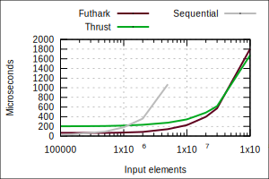
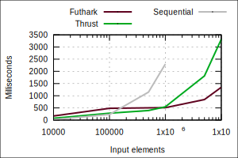
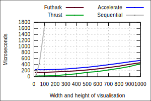
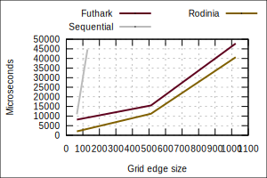

There is no good way to define what it means for a language to be
*fast*.  While some benchmark suites exist, such as the `benchmarks
game`_, they are typically designed for general-purpose CPU languages,
and thus not a natural fit for Futhark.

This page will not try to quantitatively prove that Futhark is the
fastest language ever, but instead attempt to give an intuition of
where Futhark lies in the performance space.  This is done by
comparing performance on fairly simple programs to hand-written
implementations or other high-quality GPU languages or libraries.
Unfortunately, such comparisons mostly exercise the efficiency of
basic language constructs.  These programs are too small and simple to
benefit from the ability of the Futhark compiler to significantly
restructure the original program and its data representations through
*loop fusion* and the like.

The graphs show input size on the *x*-axis, and the resulting runtime
in microseconds on the *y*-axis.  All runtimes are averaged over a
hundred runs.  For reference, we also include the runtime for Futhark
compiled to sequential CPU code.  The benchmarking setup and code can
be found `here
<https://github.com/diku-dk/futhark-website/tree/master/benchmarks>`_.

Sum (`Futhark <benchmarks/programs/sum.fut>`_, `Thrust <benchmarks/programs/sum.cu>`_)
------------------------------------------------------------------------------------------------

This program simply sums an array of integers.  We compare the Futhark
code to Thrust_, a C++ library developed by NVIDIA (now maintained as
an open source project) for GPU programming in a high-level STL-like
style.  This program resides in a Thrust sweet spot, as it can be
expressed as a single reduction with a simple operator.  Thrust has
well-implemented basic primitives, which means that matching it in
performance on simple programs is a satisfying result.  The sequential
runtime is for Futhark code compiled to sequential CPU code.

MSS (`Futhark <benchmarks/programs/mss.fut>`_, `Thrust <benchmarks/programs/mss.cu>`_)
------------------------------------------------------------------------------------------------

This graph shows performance of a *maximum segment sum* implementation
in Futhark and Thrust.  This example is interesting because it
involves a non-commutative reduction.  In Thrust, we have to implement
this via an inclusive scan followed by picking out the last element.
This is not too problematic for small input sizes, due to the high
quality of the scan implementation in Thrust, but the extra work
begins to have an impact for larger input sizes.

Mandelbrot (`Futhark <benchmarks/programs/mandelbrot.fut>`_, `Thrust <benchmarks/programs/mandelbrot.cu>`_, `Accelerate <https://github.com/AccelerateHS/accelerate-examples/tree/master/examples/mandelbrot>`_)
-------------------------------------------------------------------------------------------------------------------------------------------------------------------------------------------------------------------------------

Accelerate_ is an array language embedded in Haskell that supports
flat data-parallelism, and which comes with a backend for NVIDIA GPUs.
The design of Accelerate makes it natural to jump from CPU to GPU code
within a single Haskell program, although that is not used in this
benchmark.  When visualising the Mandelbrot set, each pixel can be
computed completely independently and with no memory accesses apart
from the final write, making it an excellent fit for GPU computing.
The amount of work done is proportional to the square of the value on
the *x*-axis.  Rendering the fractal to an image is not included in
the runtime measurement, but the visualisation looks like `this
<images/mandelbrot1000.png>`_.

HotSpot (`Futhark <benchmarks/programs/hotspot.fut>`_, `Rodinia <https://www.cs.virginia.edu/~skadron/wiki/rodinia/index.php/HotSpot>`_)
------------------------------------------------------------------------------------------------------------------------------------------------

The `Rodinia`_ suite is a collection of benchmark programs that
exercise various forms of computation.  One of these programs is
HotSpot, which Rodinia describes as:

   HotSpot is a widely used tool to estimate processor temperature
   based on an architectural floorplan and simulated power
   measurements. The thermal simulation iteratively solves a series of
   differential equations for block. Each output cell in the
   computational grid represents the average temperature value of the
   corresponding area of the chip.

Concretely, HotSpot is a rank-1 2D stencil code.  The implementation
in Futhark is similar to our `stencil example`_, although with more
complicated edge conditions.

It is a bit curious that Futhark is a *constant* amount slower than
the Rodinia implementation (about 5-6ms), no matter the dataset size.
One likely reason is that Futhark also measures the cost of allocating
intermediate arrays, which is not the case for the Rodinia
implementation.

One known overhead in the Futhark implementation is an unnecessary
copy of the entire array for every iteration of the 360-iteration
outer time series loop.  This will hopefully go away once we teach the
Futhark compiler more about reusing memory.

.. _`benchmarks game`: https://benchmarksgame.alioth.debian.org/
.. _`Thrust`: https://github.com/thrust/thrust
.. _`Accelerate`: https://github.com/AccelerateHS/accelerate
.. _`Rodinia`: https://www.cs.virginia.edu/~skadron/wiki/rodinia/index.php/Rodinia:Accelerating_Compute-Intensive_Applications_with_Accelerators
.. _`stencil example`: /examples.html#gaussian-blur-stencil
